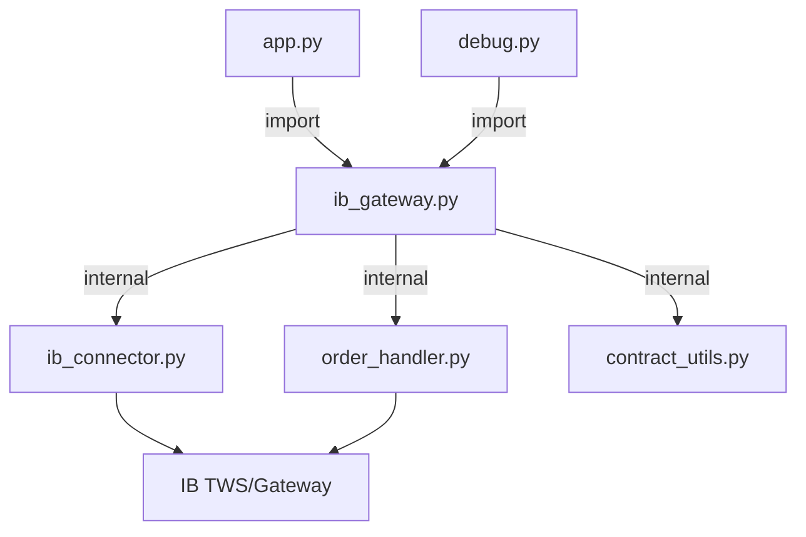

# IB Gateway Refactor Plan

## Cíl

Vytvořit [`ib_gateway.py`](ib_gateway.py) jako **facade modul** — jednoduchý, self-contained vstupní bod pro veškerou IB komunikaci. Stávající [`ib_connector.py`](ib_connector.py) a [`order_handler.py`](order_handler.py) zůstanou zachovány jako interní implementace; `ib_gateway.py` je pouze obalí čistým API.

## Architektura



**Klíčový princip:** `app.py` a `debug.py` importují POUZE `ib_gateway`. Nikdy přímo `ib_connector` ani `order_handler`.

## 1. Nový soubor: `ib_gateway.py`

Facade modul s těmito veřejnými funkcemi:

| Funkce                                                                  | Vrací          | Popis                                                                  |
| ----------------------------------------------------------------------- | -------------- | ---------------------------------------------------------------------- |
| `connect()`                                                             | `bool`         | Připojí IBConnector + spustí OrderHandler                              |
| `disconnect()`                                                          | `None`         | Odpojí vše čistě                                                       |
| `reconnect()`                                                           | `bool`         | disconnect + connect                                                   |
| `is_connected()`                                                        | `bool`         | Stav připojení                                                         |
| `get_candles(symbol, timeframe, count)`                                 | `list[dict]`   | OHLCV data — obaluje `get_historical_data`                             |
| `get_tick(symbol, asset_type)`                                          | `dict or None` | Aktuální cena — obaluje tick subscriber                                |
| `subscribe_tick(symbol, asset_type)`                                    | `None`         | Spustí tick stream pro symbol                                          |
| `unsubscribe_tick(symbol, asset_type)`                                  | `None`         | Zastaví tick stream                                                    |
| `get_account_info()`                                                    | `dict`         | Balance, margin, currency                                              |
| `get_positions()`                                                       | `list[dict]`   | Otevřené pozice                                                        |
| `place_order(symbol, action, qty, order_type, limit_price, asset_type)` | `dict`         | Výsledek orderu                                                        |
| `kill_all_connections()`                                                | `None`         | Násilně ukončí VŠECHNA IB spojení, uvolní porty, vyčistí subscriptions |

### `kill_all_connections()` implementace

1. Zavolá `disconnect()` na IBConnector i OrderHandler
2. Najde osiřelé procesy blokující IB porty (7496, 7497, 4001, 4002) pomocí `netstat`/`Get-NetTCPConnection`
3. Ukončí ty procesy přes `taskkill`
4. Vyčistí všechny tick subscriptions

### ClientId management

Stávající schéma zůstane:

- 1 = IBConnector main
- 2 = \_HistWorker
- 3+ = \_TickSubscriber (fallback)
- 6-9 = OrderHandler

`ib_gateway.py` přidá parametr `client_id_offset` pro debug.py, aby mohl běžet paralelně s app.py (offset +10).

## 2. Nový soubor: `debug.py`

Interaktivní CLI menu:

```
IB Gateway Debug Tool
=====================
1. Test connection
2. Get candles (OHLCV)
3. Stream ticks
4. Account info
5. Positions
6. Place test order
7. Kill all connections
8. Exit
```

- Importuje POUZE `ib_gateway`
- Loguje do konzole + `data/debug.log`
- Používá `client_id_offset=10` aby nekolidoval s app.py

## 3. Úprava `app.py`

- Nahradit `from ib_connector import IBConnector` → `import ib_gateway`
- Nahradit `from order_handler import OrderHandler` → (už je v ib_gateway)
- Všechna volání `ib.get_historical_data(...)` → `ib_gateway.get_candles(...)`
- Všechna volání `ib.get_ticker(...)` → `ib_gateway.get_tick(...)`
- Všechna volání `ib.get_account_info()` → `ib_gateway.get_account_info()`
- Všechna volání `ib.place_order(...)` → `ib_gateway.place_order(...)`

## 4. Soubory které se NEMĚNÍ

- [`ib_connector.py`](ib_connector.py) — zůstává jako interní implementace
- [`order_handler.py`](order_handler.py) — zůstává jako interní implementace
- [`contract_utils.py`](contract_utils.py) — zůstává jako utility
- [`config.py`](config.py) — zůstává jako konfigurace
- [`modules/`](modules/) — beze změn

## 5. Error handling strategie

- Každá funkce v `ib_gateway.py` obalí volání try/except
- Na selhání vrátí prázdný výsledek (prázdný list, None, prázdný dict) + loguje chybu
- Žádná výjimka se nepropaguje do volajícího kódu
- Logging přes standardní `logging` modul (ne jen print)

## Rizika a mitigace

| Riziko                                            | Mitigace                                         |
| ------------------------------------------------- | ------------------------------------------------ |
| Paralelní běh debug.py + app.py = clientId kolize | client_id_offset parametr                        |
| kill_all_connections zabije i app.py              | Varování v debug.py před voláním                 |
| Velký refaktor app.py = regrese                   | Postupná migrace, zachovat zpětnou kompatibilitu |
